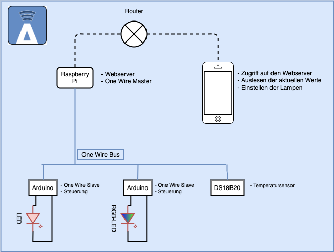
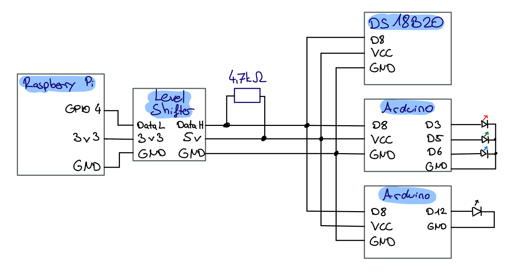

# Axela

LED Lampen im Zimmer werden über den One Wire Bus verbunden. Über einen zentralen Controller können die Lampen gesteuert werden.

- Lampen an- und ausschalten.

- RGB Lampen Farbwahl.

- Auslesen der aktuellen Temperatur

- Raspberry Pi Webserver mit Einstellungen

## Tools

### Mit ssh auf den Raspberry Pi

ssh muss auf dem Raspberry Pi aktiviert werden:  
`systemctl enable ssh`  
`systemctl start ssh`  
Dann kann sich am PC via ssh eingeloggt werden:  
`ssh pi@<raspi-ip>`  
Pro-Tipp: VSCode Plugin [Remote-SSH](https://marketplace.visualstudio.com/items?itemName=ms-vscode-remote.remote-ssh)

### Raspberry Pi GPIO Pins

[pinout.xyz](https://de.pinout.xyz)

## Installation

### One Wire Master (Raspberry Pi)

Die Kommunikationen zwischen dem Master (Raspberry Pi) und den Slaves (Arduinos) erfolgt mit One Wire. Der Raspberry Pi kann sich auf verschiedene Arten mit einem One Wire Bus verbinden. Zum Beispiel mit einem USB One Wire Master Gerät. In diesem Projekt werden jedoch die GPIO Pins verwendet.  
[Übersicht](https://blog.gegg.us/2013/03/4-different-methods-of-1-wire-access-on-raspberry-pi/)

#### One Wire im Linux Kernel ativieren

`sudo raspi-config`  
Interfaces -> 1-Wire -> Enable  
[Anleitung mit Bildern](https://www.raspberrypi-spy.co.uk/2018/02/enable-1-wire-interface-raspberry-pi/)  
[Liste von 1Wire Geräten, die mit dem Raspberry Pi Kernel funktionieren](http://rants.dyer.com.hk/rpi/1wire2019.html)

#### Raspberry Pi Kommunikation mit dem One Wire Bus

Die Kommunikation findet über den Pfad `/sys/bus/w1/devices` statt.  
In den Unterordnern sind die angeschlossenen Geräte aufgelistet. In den Dateien können die Werte im Terminal mit `cat <Dateiname>` angezeigt werden.

- Sensoren erzeugen die Datei `w1_slave`. Darin stehen die Sensorwerte.
- Der 8-Channel Schalter DS2408 erzeugt die Datei `output`. Darin stehen in 8 Bit die aktuellen Schalterstellungen. Diese können einzeln geändert werden, indem man sie mit einem Byte überschreibt. Dafür können ASCII-Zeichen verwendet werden.

### Webserver (Raspberry Pi)

nginx und php-fpm stellen die Webseite bereit.

#### NGINX

Installieren: `sudo apt install nginx`  
nginx Dienst starten: `sudo systemctl start nginx`  
NGINX Einstellungen: `/etc/nginx/sites-enabled/...`  
Standard Website Verzeichnis: `/var/www/html`

#### PHP-FPM

Php installieren: `sudo apt install php-fpm`  
Php in nginx aktivieren:  
In Konfigurationsdatei `/etc/nginx/sites-enabled/…` ändern:

- In der Zeile mit dem Inhalt `index index.html index.htm;` hinzufügen: `index.php`
- Bei location einkommentieren: Sontiges einkommentieren, nur das mit php-fpm.

#### Website

Wenn der Webserver eingerichtet ist, können die Website-Dateien in das Webserver-Verzeichnis kopiert werden. Die Website-Daten befinden sich im Git im Ordner `Axela/webserver`. Das Standard-Verzeichnis bei nginx ist `/var/www/html`.

### One Wire Slave (Arduino)

Um einen Arduino als One Wire Slave Gerät zu benutzen wird die Bibliothek [OneWireHub](https://github.com/orgua/OneWireHub) verwendet.

#### OneWireHub (Arduino IDE)

1. Die Bibliothek [OneWireHub](https://github.com/orgua/OneWireHub) Arduino IDE installieren (Tools -> Manage Libraries... -> Suchfeld: OneWireHub).

2. Im OneWireHub-Bibliotheks-Ordner (`Dokumente/Arduino/libraries/OneWireHub/src`) die Datei `OneWireHub_config.h` bearbeiten. Damit der Arduino vom Raspberry Pi als One Wire Slave erkannt wird die Variable `ONEWIRE_TIME_MSG_HIGH_TIMEOUT` auf `38000_us`gesetzt.  
`constexpr timeOW_t ONEWIRE_TIME_MSG_HIGH_TIMEOUT = { 38000_us };`

3. Das gewünschte Gerät aus dem Axela Projekt Ordner `Axela/devices`auswählen und das zugehörige Skript auf den Arduino laden.

## Schaltplan

## Entwickler-Notizen

Prinzipiell funktioniert das System. Die Steuerung der LEDs ist manchmal ein bisschen laggy. One Wire Bus scheint eine sehr gute Lösung für vorgefertigte One Wire Sensoren zu sein. Aktuatoren funktionieren jedoch nicht so gut. Im Nachhinein würden wir ein anderes Bussystem wählen.
